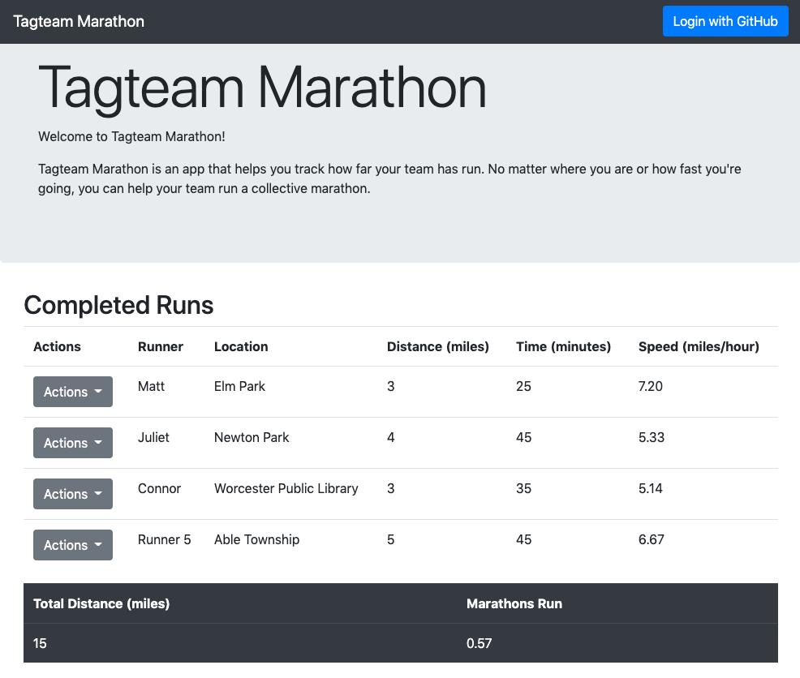
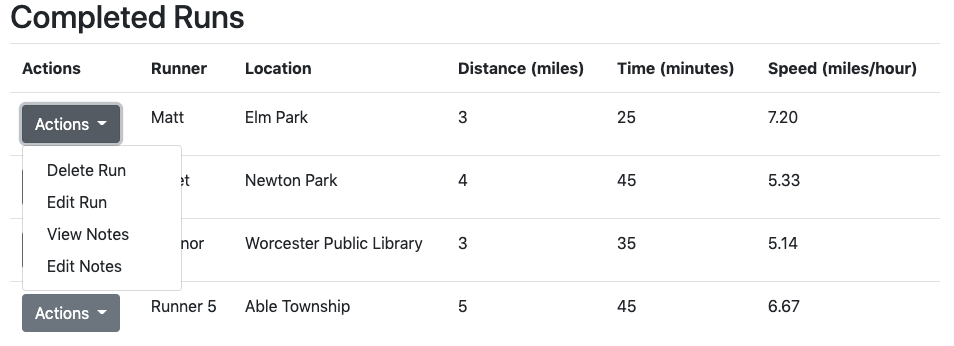

# Assignment 4 - Components - Matthew St Louis - Tagteam Marathon

Hosting link: [https://a4-mastlouis.herokuapp.com](https://a4-mastlouis.herokuapp.com)

## React
I attempted to reimplement my A3 page in React. I changed the fundamental flow of data through the application but tried to keep things as similar as I could.

React greatly helped in the development experience. The components were particularly amazing for table data. I was shocked how much easier the development was when I didn't have to pass indices back and forth to reference global data. One part of the development that was greatly hindered was setting data to be used by the whole app with GET requests. I tried to have promises update data in the app, but this led to infinite loops. I needed to get a bit hack-y to stop the loops, and an unfortunate side effect is that the user can sometimes see the login screen between updates to the page even if they are already signed in.

## Core Functionality
Here is what the application is supposed to do as copied from the README for A3. One alteration is that the notification for creating a new user may not display if the same GitHub account was used for the last assignment as the database is shared.

Unfortunately, the only actions that work are adding a run, viewing notes, and deleting a run. I was unable to implement the functionality for editing a run or for editing notes.

Also, one strange thing I notice is that the React Dev Chrome extension doesn't light up on the Heroku site like it does on Localhost, and I don't understand why this is. I deploy from the build folder the same way I do from localhost.

### Goal
This project is a new version of my project for the last assignment - [Tagteam Marathon](https://github.com/mastlouis/a2-shortstack), but most of the code has been changed.

Tagteam Marathon is an app to help teams of runners share their runs with each other and track their collective progress. The intended use of this is for runners who want to have a social aspect to their runs without physically meeting up during the time of social distancing. Users can log in with GitHub to add, modify, and delete runs.

Currently, runs are tied to specific accounts, and there is no way to share runs across accounts, so the app is only suited for runners tracking their runs as an individual. However, the app provides all functionality necessary to meet this goal.

### Usage
To get started with TagTeam marathon, sign in with GitHub using the button in the upper right of the page.

__The first time you sign in, you will get an `alert()` notifying you that an account has been created with the app. It will only appear once. Please do not miss it.__

You can add new runs via the New Run form at the bottom of the page. Submit with the Submit button.

Once you have submitted a run, it will display in the Completed Runs table. This table will initially be empty, as the new user will not have any runs before they add one.

You can view the notes in a saved run with the __View Notes__ button in the __Completed Runs__ table under the __Actions__ menu. You can edit these notes with the __Edit Notes__ button in the same menu.

To delete a run, use the __Delete Run__ button in the __Actions__ menu on the __Completed Runs__ table.

To modify a run, use the __Edit Run__ button in the __Actions__ menu on the __Completed Runs__ table. This will transform the relevant table entries to inputs where the user can edit the data. Save this with the __Submit Edits__ button that now appears under the __Actions__ menu, or discard changes either with the __Cancel Edits__ button under the __Actions__ menu or by editing another run.

